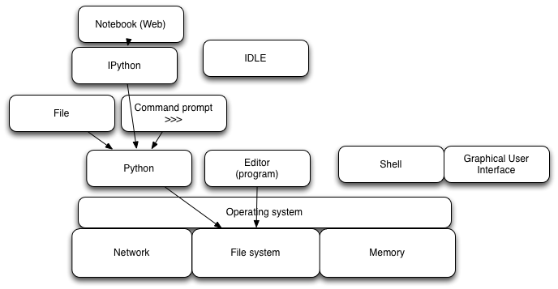

Day 2 / Morning
===============

Scripting with Python, and running scripts at command line
----------------------------------------------------------

(Rich Enbody)

The final script from this section is available as:

   https://github.com/swcarpentry/2013-04-az/blob/master/scripts/birds.py

or as 'scripts/birds.py'.  Note that the data is in 'data/birds.csv'.

How computers work; online editing at github
--------------------------------------------

(Titus Brown)

Github
~~~~~~

Please sign up for an account at http://github.com/, and then log in.

We will:

1. Go to https://github.com/swcarpentry/2013-04-az

2. Click on the "Fork" button to make a local copy into YOUR account.

3. Go into the 'example' directory in your own account, which should be
   https://github.com/(ACCOUNT)/2013-04-az/tree/master/example

4. Click on *either* CHANGEME.txt *or* CHANGEME-2.txt

5. Click on Edit.

6. Make some changes.

7. Save and provide a commit message.
